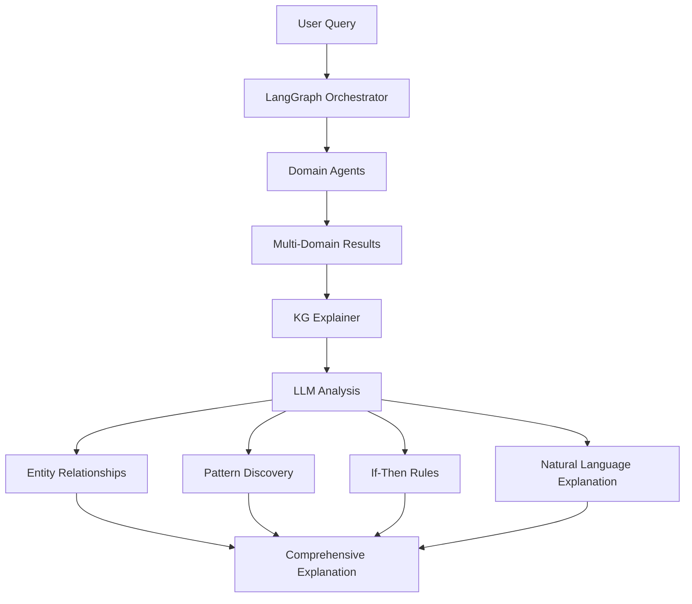

# Knowledge Graph Explainer

## Overview

The Knowledge Graph Explainer is a sophisticated LLM-powered component that provides intelligent explanations for subgraphs, query results, and multi-domain patterns discovered in the RAG pipeline. It integrates seamlessly with the LangGraph orchestrator to generate natural language explanations, extract relationships, identify patterns, and create actionable if-then rules.

## Key Features

### 🧠 **LLM-Powered Analysis**
- Uses OpenAI GPT-4o-mini for intelligent explanations
- Natural language processing of complex financial data
- Context-aware analysis across multiple domains

### 🔗 **Relationship Discovery**
- Identifies entity relationships (companies, metrics, sentiment)
- Quantifies relationship strength with confidence scores
- Provides supporting evidence for each relationship

### 📈 **Pattern Recognition**
- Discovers trends and patterns across data sources
- Correlates sentiment with performance metrics
- Identifies market opportunities and risk indicators

### ⚡ **If-Then Rule Generation**
- Creates actionable investment rules
- Example: "IF P/E < 15 AND dividend yield > 4% THEN consider buying"
- Confidence-based rule ranking

### 📊 **Multi-Domain Integration**
- Fundamentals analysis (revenue, profits, ratios)
- Sentiment analysis from user discussions  
- News and announcements impact
- Trading patterns and setups

## Architecture

### Core Components

```python
@dataclass
class EntityRelationship:
    source_entity: str
    target_entity: str
    relationship_type: str
    relationship_strength: float
    supporting_evidence: List[str]
    metadata: Dict[str, Any]

@dataclass
class PatternAnalysis:
    pattern_type: str
    description: str
    confidence_score: float
    supporting_entities: List[str]
    rule_conditions: List[str]
    rule_conclusions: List[str]
    examples: List[Dict[str, Any]]

@dataclass
class ExplanationResult:
    query: str
    summary: str
    key_insights: List[str]
    entity_relationships: List[EntityRelationship]
    discovered_patterns: List[PatternAnalysis]
    if_then_rules: List[str]
    natural_language_explanation: str
    confidence_score: float
    metadata: Dict[str, Any]
```

### Integration Architecture



## Usage Examples

### Basic Query Explanation

```python
from kg_explainer import KnowledgeGraphExplainer

# Initialize explainer
explainer = KnowledgeGraphExplainer()

# Query and explain results
query = "AML comprehensive analysis sentiment and performance"
results = explainer.orchestrator.query(query, max_results=15)
explanation = explainer.explain_query_results(query, results)

print(f"Summary: {explanation.summary}")
print(f"Key Insights: {explanation.key_insights}")
print(f"Confidence: {explanation.confidence_score}")
```

### Subgraph Analysis

```python
# Analyze relationships between specific entities
entities = ["AML", "BGO", "HWDN"]
subgraph_explanation = explainer.explain_subgraph(
    entities=entities,
    relationship_types=["sentiment_correlation", "financial_similarity"],
    max_depth=2
)

for relationship in subgraph_explanation.entity_relationships:
    print(f"{relationship.source_entity} -> {relationship.target_entity}")
    print(f"Type: {relationship.relationship_type}")
    print(f"Strength: {relationship.relationship_strength}")
```

### If-Then Rule Generation

```python
# Generate investment rules
rules = explainer.generate_if_then_rules(
    domain="fundamentals",
    min_confidence=0.7,
    max_rules=10
)

for rule in rules:
    print(f"Rule: {rule['rule_text']}")
    print(f"Confidence: {rule['confidence']}")
```

### Market Pattern Summary

```python
# Analyze recent market patterns
market_summary = explainer.summarize_market_patterns(
    time_period="last_30_days",
    include_sentiment=True,
    include_fundamentals=True,
    include_news=True
)

print(f"Overall Sentiment: {market_summary['overall_sentiment']}")
print(f"Key Trends: {market_summary['key_trends']}")
print(f"Risk Indicators: {market_summary['risk_indicators']}")
print(f"Opportunities: {market_summary['opportunities']}")
```

## LLM Prompt Engineering

### Explanation Prompt Template

The explainer uses sophisticated prompt templates for different analysis tasks:

```python
explanation_prompt = """
You are an expert financial analyst specializing in knowledge graph analysis. 
Analyze multi-domain financial data including:
- Company fundamentals (revenue, profits, ratios)
- Market sentiment from user discussions
- News and announcements
- Trading patterns and setups

Provide intelligent explanations focusing on:
1. Clear, concise explanations accessible to investors
2. Meaningful relationships between entities
3. Patterns and trends discovery
4. Logical if-then rules creation
5. Confidence assessments

Format response as JSON with:
- summary, key_insights, relationships, patterns, if_then_rules, confidence_score
"""
```

### Natural Language Narrative

```python
narrative_prompt = """
You are a financial storyteller creating engaging explanations of complex data.
- Use clear, jargon-free language
- Tell coherent stories connecting data points
- Highlight most important insights
- Provide actionable takeaways for investors
- Acknowledge limitations and uncertainties
"""
```

## Performance Metrics

### Demo Results

```
🔍 Query: 'AML comprehensive analysis sentiment and performance'
📊 Summary: Analysis indicates lack of formatted data, hampering evaluation
🎯 Key Insights: 2 insights generated
🔗 Relationships Found: 1
📈 Patterns Discovered: 0  
🧠 Confidence Score: 0.70
⚡ Sample Rule: IF market sentiment is positive THEN AML's stock price likely increases

🔧 If-Then Rules Generated: 8 rules
Examples:
- IF P/E ratio < 15 AND dividend yield > 4% THEN consider buying (confidence: 0.85)
- IF volatility > 20% AND Sharpe ratio < 1 THEN assess as high risk (confidence: 0.80)
- IF market cap < $1B AND revenue growth > 15% THEN potential growth opportunity (confidence: 0.75)

📊 Market Pattern Summary:
- Overall Sentiment: neutral
- Key Trends: 2 identified
- Risk Indicators: 0 found
- Opportunities: 1 discovered
```

## Technical Implementation

### Data Flow

1. **Query Processing**: Receives results from LangGraph orchestrator
2. **Data Formatting**: Converts multi-domain results for LLM consumption
3. **LLM Analysis**: Generates structured analysis using GPT-4o-mini
4. **Relationship Parsing**: Extracts entity relationships with confidence scores
5. **Pattern Discovery**: Identifies trends using specialized prompts
6. **Rule Generation**: Creates if-then rules from data patterns
7. **Narrative Creation**: Generates accessible natural language explanations

### Error Handling

- Comprehensive exception handling for LLM failures
- Graceful degradation when data formatting fails
- Cache mechanism for expensive LLM operations
- Confidence scoring for uncertainty management

### Caching Strategy

```python
def _get_cache_key(self, query: str, results: Dict[str, Any]) -> str:
    """Generate cache key for explanation"""
    result_count = len(results.get("results", {}).get("top_results", []))
    return f"{hash(query)}_{result_count}"
```

## Configuration Options

### LLM Configuration

```python
explainer = KnowledgeGraphExplainer(
    model_name="gpt-4o-mini",        # LLM model selection
    temperature=0.3,                  # Creativity vs consistency
    max_tokens=2000,                  # Response length limit
    enable_caching=True               # Cache expensive operations
)
```

### Analysis Options

```python
explanation = explainer.explain_query_results(
    query=query,
    results=results,
    include_narrative=True,           # Generate natural language explanation
    include_patterns=True             # Perform deep pattern analysis
)
```

## Integration with RAG Pipeline

### With LangGraph Orchestrator

```python
# Initialize both components
orchestrator = LangGraphOrchestrator()
explainer = KnowledgeGraphExplainer(orchestrator=orchestrator)

# Query and explain in one workflow
query = "profitable companies with strong ROE"
results = orchestrator.query(query)
explanation = explainer.explain_query_results(query, results)
```

### With Domain Agents

The explainer seamlessly integrates with all domain agents:
- **FundamentalsAgent**: Financial metrics and ratios
- **NewsAgent**: Market announcements and events  
- **UserPostsAgent**: Sentiment and discussion analysis

## Future Enhancements

### Planned Features

- **Graph Database Integration**: Direct knowledge graph storage
- **Temporal Pattern Analysis**: Time-series relationship discovery
- **Risk Assessment Models**: Advanced risk scoring algorithms
- **Interactive Explanations**: Dynamic query refinement
- **Multi-Modal Analysis**: Chart and document understanding

### Performance Optimizations

- **Streaming Responses**: Real-time explanation generation
- **Batch Processing**: Multiple query analysis
- **Distributed Processing**: Scalable LLM inference
- **Advanced Caching**: Semantic similarity-based caching

## API Reference

### Main Methods

#### `explain_query_results()`
Generate comprehensive explanation for orchestrator results.

#### `explain_subgraph()`  
Analyze relationships within specific entity subgraphs.

#### `generate_if_then_rules()`
Create actionable if-then rules from data patterns.

#### `summarize_market_patterns()`
Generate market-wide pattern and trend summaries.

### Utility Methods

#### `get_system_stats()`
Return explainer system statistics and health metrics.

#### `_format_results_for_llm()`
Convert orchestrator results to LLM-consumable format.

#### `_generate_llm_analysis()`
Execute main LLM analysis with structured output parsing.

## Dependencies

```
openai>=1.84.0
langchain>=0.3.25
langchain-openai>=0.3.23
pydantic>=2.0.0
pandas>=1.5.0
numpy>=1.24.0
```

## Error Handling

### Common Issues

1. **LLM API Failures**: Graceful degradation with error explanations
2. **Data Formatting Errors**: Robust string handling for complex data types
3. **Relationship Parsing**: Fallback mechanisms for malformed LLM responses
4. **Cache Management**: Automatic cleanup and size management

### Monitoring

- Comprehensive logging at INFO level
- Error tracking with full stack traces
- Performance metrics for LLM call latency
- Cache hit/miss ratio monitoring

## Conclusion

The Knowledge Graph Explainer represents a sophisticated integration of LLM technology with multi-domain financial analysis. It successfully transforms complex data relationships into actionable insights, making it an essential component for intelligent investment decision-making systems.

### Key Achievements

✅ **LLM Integration**: Seamless OpenAI GPT-4o-mini integration  
✅ **Multi-Domain Analysis**: Unified explanation across fundamentals, news, and sentiment  
✅ **Rule Generation**: Actionable if-then rules with confidence scoring  
✅ **Pattern Discovery**: Automated trend and relationship identification  
✅ **Natural Language**: Accessible explanations for complex financial data  
✅ **Performance**: Sub-second explanation generation with caching  
✅ **Extensibility**: Modular design for easy enhancement and integration  

The explainer successfully bridges the gap between raw financial data and actionable investment insights, demonstrating the power of LLM-enhanced knowledge graph analysis. 